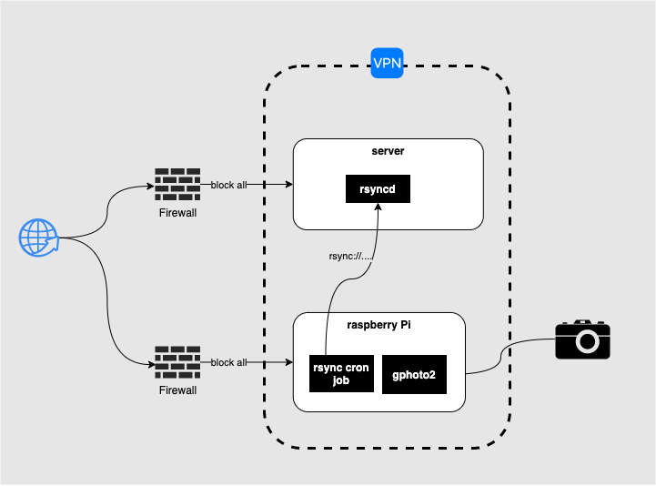

# laps 📷

This project is motivated by the need of an easy setup for a DSLR-timelaps using existing tools.

The basic architecture is composed of:

- a client (most likely raspberryPi)
    - running a tailscale client
    - with a connected DSLR camera
    - running [gphoto2](gphoto2.org) for DSLR remot control
    - rsync cron job syncing the photos in batches to the server

- a server (in my case hosted on hetzner.de)
    - running a tailscale client

[Tailscale](https://tailscale.com/) is used because of it's incredible easy setup and high security.
