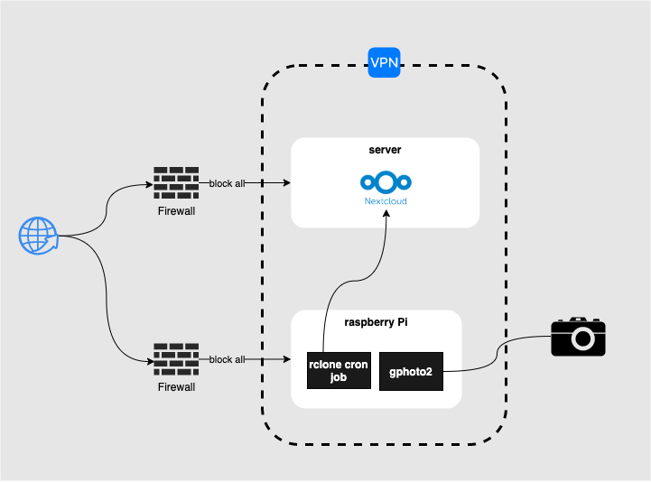

# laps 📷

This project is motivated by the need of an easy setup for a DSLR-timelaps using existing tools.

I'm using [Tailscale](https://tailscale.com/) (because of it's incredible easy setup) to keep the communication secure.
Of course you set up `laps` without a vpn in place, but it is not recommended cause:

- vpn adds an additional layer of security around all networking (including the setup via ansible)
- no authentication/authorization in place for the `rsyncd` service



The architecture is composed of:

- a **client** (most likely raspberryPi)
    - running a tailscale client
    - with a connected DSLR camera
    - running [gphoto2](gphoto2.org) for DSLR remote control
    - running an rsync cron job: syncing the photos in batches to the server

- a **server** (in my case hosted on hetzner.de)
    - running a tailscale client
    - running an `rsyncd` service on port `12000` for faster communication and easy syncing


## Setup

> As mentioned above I rely on an already set up network connection via [Tailscale](https://tailscale.com/) VPN.

As a prerequisite you need:

- [docker](https://docs.docker.com/get-docker/)
- [task](taskfile.dev)

installed on your local machine.

The central place of configuration lives in [ansible/inventory.yml](ansible/inventory.yml).
This file is the single source of thruth and all other files are populated with values from [ansible/inventory.yml](ansible/inventory.yml) during provisioning.

The only mandatory configuration you have to make is the client's and server's IP adress for ansible to connect to:
```yml
all:
  hosts:
  children:
    client:
      hosts:
        100.95.134.119: # client's IP address (within the tailscale vpn)
    server:
      hosts:
        100.66.102.123: # server's IP address (within the tailscale vpn)
```


To provision the client run:

```bash
task client
```

To provision the server run:
```bash
task server
```


### TODO

- [x] (use ansible instead of scripts)
- [ ] (introduce lockfile for rsync cron job, preventing parallel upload processes)

### MISC

**Test the connection from a client connected via the tailscale vpn:**
```bash
rsync -rdt rsync://IPADDR:12000/
```

**SSH setup**

```bash
ssh-keygen -f ./client.key -t ecdsa -b 521  
ssh-copy-id -i ./client.key user@host
mv client.key ansible/
```